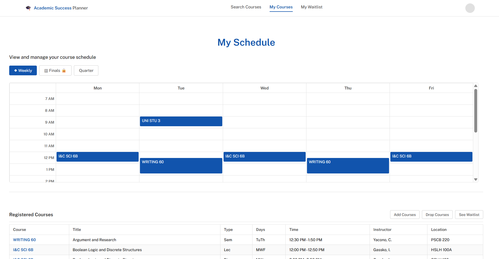
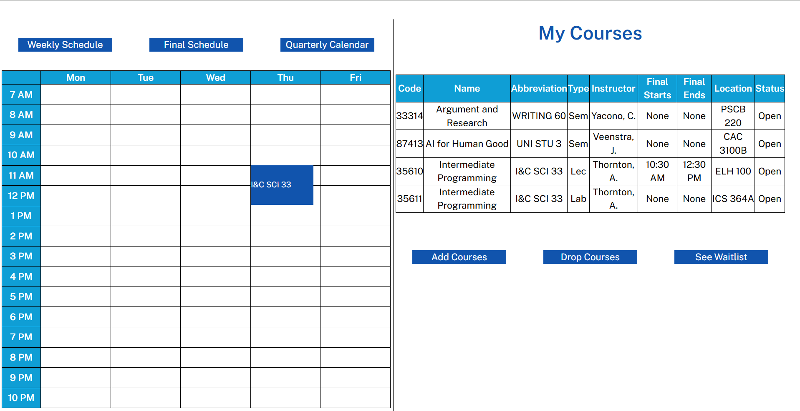
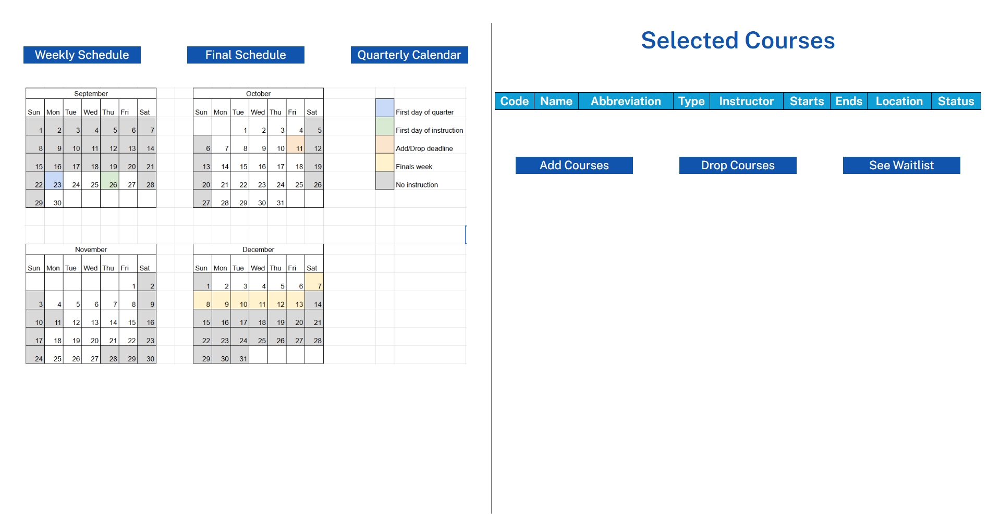
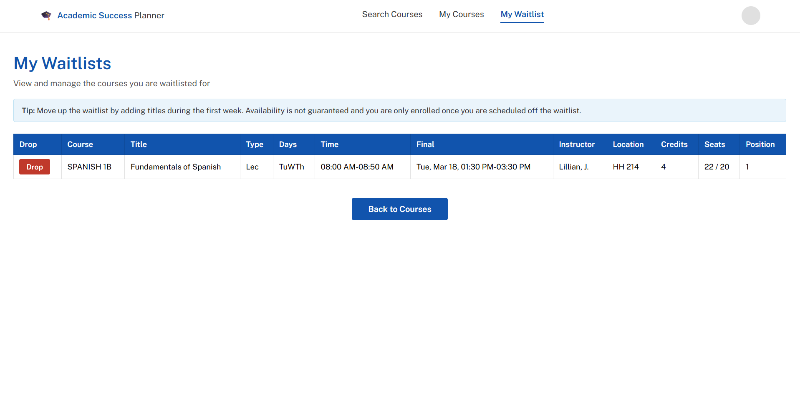
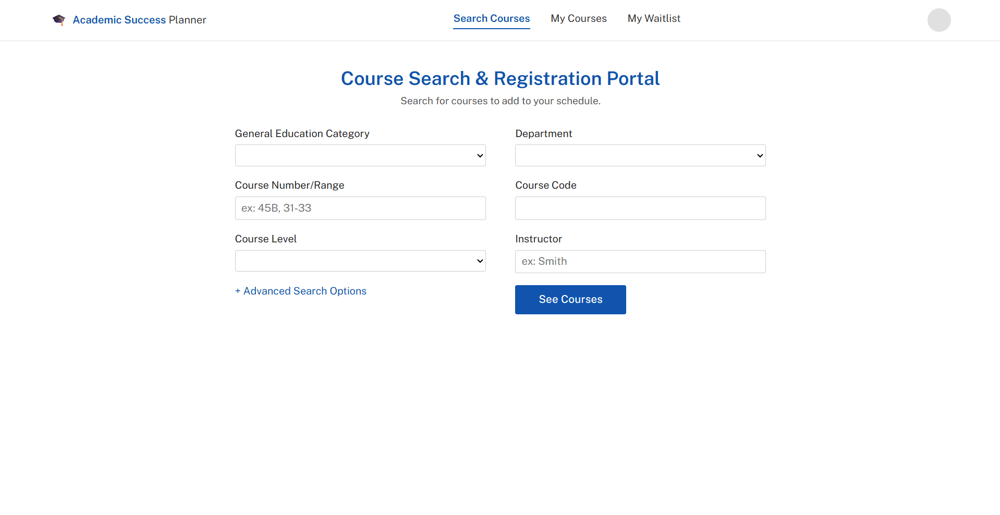
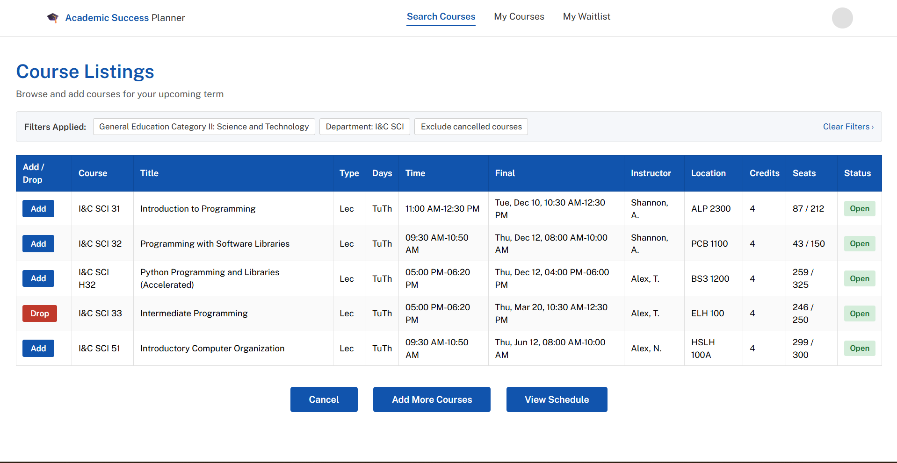

# 🧠 Academic Success Planner
An AI-powered course scheduling & workload optimization system

## 📌 Problem
Students often build course schedules based on availability — not outcomes. They lack insight into:
- Workload balance
- Burnout risk
- Impact on academic performance
- Tradeoffs between different course combinations

As a result, students may unintentionally create schedules that lead to overload, poor performance, or burnout.

## 💡 Solution
The Academic Success Planner is a decision-support system that helps students:
- Build course schedules
- Evaluate workload and difficulty
- Predict academic performance risk
- Compare alternative schedules
- Make informed, optimized decisisons

This system aims to help students make better academic decisions by transforming course selection from a trial-and-error process into a data-informed planning experience.

## ⚙️ What This Project Does
This system goes beyond traditional course registration by helping students evaluate and optimize their schedules based on workload, risk, and academic outcomes.
- Enables students to create and manage course schedules
- Applies real-world constraints (capacity, prerequisites, waitlists)
- Estimates workload and schedule difficulty
- Identifies high-risk (oveloaded) schedules
- Recommends improved course combinations
- Explains why certain schedules are better

## 🧩 Key Features

### 🧱 Core System
The current platform supports core course registration workflows, including:
- Browse available courses and view detailed course information
- Filter courses based on criteria such as department or availability
- Register for and drop classes in real time
- Join waitlists for courses that have reached capacity

### ⚙️ Backend Logic & Constraints
The backend enforces key registration rules to maintain a consistent system state, including:
- Enrollment caps per course
- Automatic waitlisting when courses reach capacity
- Prevention of duplicate enrollments
- Server-side validation of schedule updates
- Prerequisite validation and registration rule enforcement

These constraints are handled through application logic and database-backed validation to ensure reliability regardless of frontend behavior.

### 🧠 Intelligence Layer (In Progress)
The next phase of development expands the system from registration into academic planning and decision support:
- Workload estimation using course difficulty modeling
- Burnout risk detection for overloaded schedules
- GPA / performance prediction (planned)
- Schedule optimization and personalized recommendations

### 🔄 Decision Engine (Planned)
To support better academic decision-making, future versions will include:
- Comparison of multiple schedule options
- Alternative course combination suggestions
- Tradeoff analysis across workload, difficulty, and expected performance

### 📊 Explainability (Planned)
To make recommendations more transparent, the system will explain:
- Why a schedule is recommended
- Why a schedule may lead to overload
- What tradeoffs exist between different schedule choices

## 🎯 Scope
This project is being developed in phases, evolving from a course registration system into an academic decision-support platform.
The current phase emphasizes correctness, consistency, and core scheduling workflows.
Future phases will expand the system to include:
- User authentication and personalization
- Deployment for live access
- Enhanced UI/UX for improved usability
- Intelligent planning and decision-support capabilities

## 🏗️ System Architecture & Tech Stack
The system separates user-specific planning data from academic course data within a structured relational database, enabling consistent constraint enforcement and a foundation for future integration with external data sources.

Frontend: HTML/CSS  
Backend: Python (Flask)  
Database: SQLite  
Concepts:
- RESTful routing
- Server-side validation
- Relational data modeling
- Constraint-based logic

## ⚙️ Running Locally
To run this project locally:
1. Ensure Python (3.9+) and SQLite are installed on your machine.
2. Clone the repository and navigate to the project directory.
3. Create and activate a virtual environment, then install the required dependencies.
4. Create a .env file in the root directory to store environment variables such as the Flask configuration, secret key, and database connection details.
5. An .env.example file is provided to show the required environment variables and expected format.
6. Start the Flask development server.
7. Open the application in your browser at http://127.0.0.1:5000.
8. You should now be able to use the dashboard locally to view, add, drop, and waitlist courses.

### 📊 Database Setup
- The application uses a relational database with tables representing courses, departments, instructors, etc.
- Create a SQLite database for the application.
- Database tables are created manually during development.
- A formal schema or migration setup is planned as a future improvement.

## 🎯 Example Use Case
A student selects 4 technical courses
The system:
- Flags high workload
- Estimates elevated burnout risk
- Suggests replacing one course
- Explains the tradeoff (e.g., "Replacing CS 143 with CS 122 reduces workload by 25% and improves expected performance")

## 🚧 Project Status
This project is under active development.  
Phase 1: Course planning system  
Phase 2: Workload modeling & risk detection  
Phase 3: Recommendation engine & schedule optimization  
Phase 4: Explainability & user insights  

## 🚀 Future Enhancements
- Personalized course recommendations based on academic goals
- Workload estimation and burnout risk analysis
- Schedule optimization and alternative course suggestions
- Time allocation and study planning support
- Historical performance tracking
- Advanced scheduling constraints (e.g., time conflicts, instructor preferences)

## 🧠 What I Learned
- Designing systems with real-world constraints
- Building relational data models for complex workflows
- Balancing backend logic with user experience
- Thinking beyond functionality toward decision-support systems

## 📷 Demo / Screenshots
 
 
 
