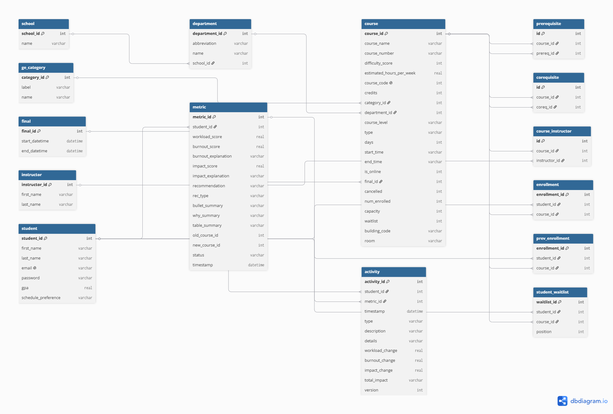

# 🧠 Academic Success Planner
 
A smart academic decision-support system for course scheduling and workload management — helping students plan schedules around *outcomes*, not just availability.
 
**[🔗 Live demo](https://nvygreen.pythonanywhere.com/)** · **Demo login:** demo@example.com / 12345
 
---
 
## 📌 Problem
Students often build course schedules based on availability — not outcomes. They lack insight into:
- Workload balance
- Burnout risk
- Impact on academic performance
- Tradeoffs between different course combinations
As a result, students may unintentionally create schedules that lead to overload, poor performance, or burnout.
 
## 💡 Solution
The Academic Success Planner is a decision-support system that helps students:
- Build and manage course schedules under real registration constraints
- Evaluate workload, difficulty, and burnout risk
- Compare a current schedule against a recommended alternative
- Get explainable drop/swap recommendations with before/after tradeoffs
It transforms course selection from a trial-and-error process into a data-informed planning experience.
 
---
 
## 🧩 Key Features
 
### 🧱 Core Registration System
- Browse courses and view detailed course information
- Filter courses by criteria such as department or availability
- Register for and drop classes in real time
- Join waitlists for courses that have reached capacity
### ⚙️ Backend Logic & Constraints
The backend enforces registration rules through application logic and database-backed validation, so state stays consistent regardless of frontend behavior:
- Enrollment caps per course, with automatic waitlisting at capacity
- Prevention of duplicate enrollments
- Prerequisite and corequisite validation
- **Time-conflict detection** — rejects a course that overlaps an already-enrolled meeting time
- Server-side validation of all schedule updates
### 🧠 Intelligence Layer
The system models the academic cost of a schedule, not just its validity:
- Workload estimation using difficulty-weighted course modeling
- Burnout-risk scoring (course count, difficulty density, and workload band)
- Academic-impact estimation scaled by the student's standing
### 🔄 Decision Engine
- Generates drop-or-swap recommendations based on workload and burnout
- Searches for a suitable swap (same department first, then school-wide), respecting prerequisites
- Compares the current schedule against the recommended one across workload, burnout risk, and balance
### 📊 Explainability
- Before/after impact summaries for each recommendation (e.g. hours saved, burnout category change)
- Plain-language reasons a schedule is flagged as high-risk
- Tradeoff explanations so students understand *why* a change is suggested
> Recommendations can be **applied or dismissed**, and the history is surfaced on the Activity Insights page.
 
---
 
## ✅ Engineering & Quality
 
- **241 automated tests** spanning pure logic, database integration, and request-level route tests (HTTP routing, auth/session handling, and template rendering via Flask's `test_client`) — **86% line coverage** overall, run on every push via **GitHub Actions CI**
- **Recommendation eval harness** — the drop/swap engine is scored against 30 schedule scenarios with boundary cases labeled by students. A gated fix to the burnout-override logic improved agreement on the labeled boundary cases from 0/5 to 4/5 (see `eval/results/latest.txt` for the full before/after write-up)
- **Load tested** with Locust at 50 concurrent users (~40 req/s, 0% failures); a 19s tail-latency spike was traced to the Werkzeug dev server dropping connections under load — not query cost — and confirmed fixed under a production WSGI server (Waitress), dropping the tail from ~19s to <1s
- **Security hardening:** parameterized SQL with allowlist-validated identifiers, CSRF protection, redirect-safety checks, `pbkdf2_sha256` password hashing, and startup rejection of weak `SECRET_KEY`s
- **SQLite tuning:** WAL mode + busy-timeout for concurrent read/write access

---
 
## 🏗️ Architecture & Tech Stack
 
**Frontend:** HTML / CSS · **Backend:** Python (Flask) · **Database:** SQLite
**Testing/CI:** pytest, GitHub Actions · **Load testing:** Locust, Waitress
 
The codebase separates concerns into focused modules — registration, recommendation, analytics, filtering, and the decision engine — over a normalized relational schema that keeps academic data and student-planning data distinct.
 
### Data Architecture


Design highlights:
- Core academic entities (courses, departments, instructors)
- Enrollment and waitlist modeling
- Prerequisite and corequisite relationships (modeled as edge tables)
- Many-to-many instructor mapping

---

## ⚙️ Running Locally
To run this project locally:
1. Ensure Python (3.13) and SQLite are installed on your machine.
2. Clone the repository and navigate to the project directory.
3. Create and activate a virtual environment.  
Mac:
```
python3 -m venv .venv
```

```
source .venv/bin/activate
```

Windows:
```
python -m venv .venv
```

```
.venv\Scripts\activate
```
4. Install the required dependencies by running `pip install -r requirements.txt` in your terminal.
5. Create a `.env` file in the root directory by copying from `.env.example` (`cp .env.example .env`) and fill in the values:  
   a. FLASK_APP = the app package: `course_reg`  
   b. FLASK_DEBUG = `1` for local development  
   c. SQLITE3_DB = name of your local database file (e.g., `dev.db`) — it is created and seeded automatically on first run  
   d. SECRET_KEY = a strong random key, at least 32 characters. Generate one with: `python -c "import secrets;print(secrets.token_hex(32))"`  
   e. SEED_EMAIL = the email for your initial login account  
   f. SEED_PWD = a pbkdf2_sha256 hash of your password, not plaintext. Generate one with: `python -c "from passlib.hash import pbkdf2_sha256; print(pbkdf2_sha256.hash('your-password'))"`
6. Start the Flask development server by running `flask run` in your terminal.
7. Open the application in your browser at http://127.0.0.1:5000.
8. Log in with your SEED_EMAIL and the password you hashed for SEED_PWD. You should now be able to use the dashboard locally to view, add, drop, and waitlist courses.

### Database Setup
On startup, if the database file is empty, the app automatically initializes all tables and seeds course data — so a fresh clone runs without manual database setup.
 
### Running the Tests / Eval
```
pip install -r requirements-test.txt
python -m pytest tests/
python eval_scoring.py eval/labeled_schedules.csv   # recommendation eval
```
 
---

## 🎯 Example Use Case
A student enrolls in 4 technical courses. The system:
- Flags the schedule as high workload
- Estimates elevated burnout risk
- Recommends swapping one course for a lighter alternative
- Explains the tradeoff (e.g. "swapping reduces estimated weekly hours and lowers burnout from High to Moderate")
---
 
## 🚀 Future Enhancements
- Expand the catalog with real UCI course data
- GPA / performance prediction from historical grade data
- Personalized recommendations driven by stated academic goals
- Study-time allocation and planning support
- Externalized scheduled waitlist promotion (standalone CLI task + cron)
---
 
## 🧠 What I Learned
- Designing and enforcing real-world registration constraints
- Building a decision engine and then *measuring* whether its recommendations agree with human judgment
- Diagnosing performance problems with controlled load testing rather than guessing
- Treating heuristics skeptically — validating thresholds against labeled cases instead of trusting intuition
---
 
## 📷 Demo / Screenshots
 
 